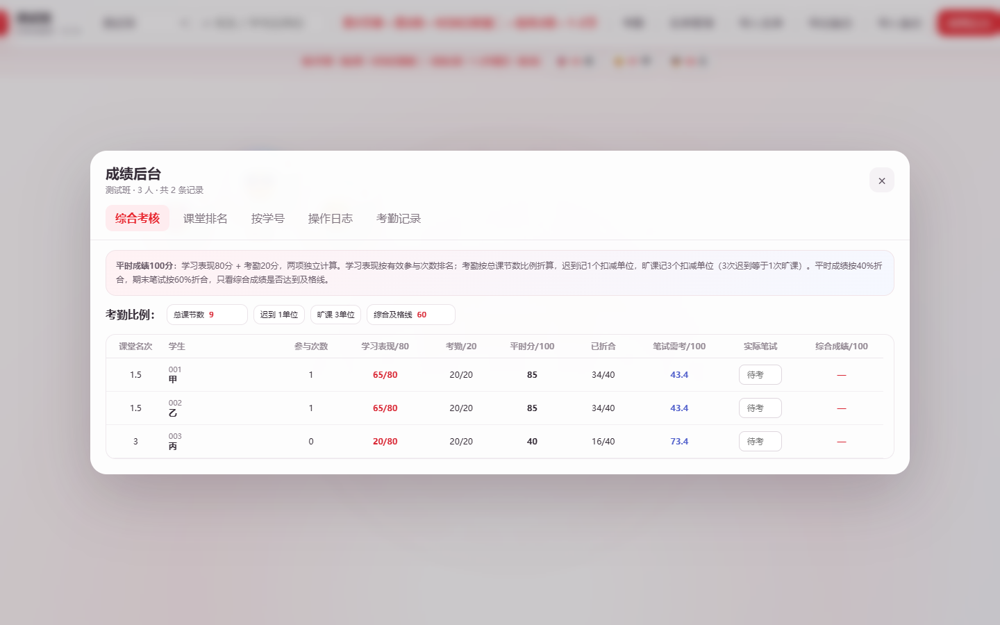
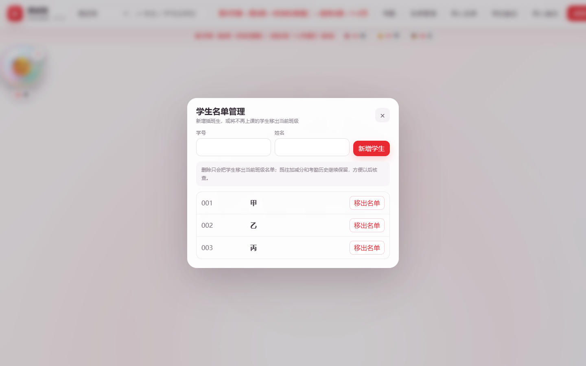

# 课堂气泡赋分平台

一款面向教师课堂现场使用的可视化平时成绩工具。每位学生是一枚会碰撞、下坠和反弹的气泡；教师点击气泡即可记录一次有效课堂参与，长按可登记考勤，所有记录按班级、日期和课次分别保存。

> 设计目标不是让教师在课堂上反复填写表格，而是把“点一次、记一次、课后自动汇总”做得足够快。

## 在线使用

- [公开演示版](https://zcq19991029.github.io/classroom-bubble-score/)：使用虚构名单，可直接体验，不包含真实学生数据。
- [教师云端版](https://zcq19991029.github.io/classroom-bubble-score/cloud.html)：登录后按账号保存多个班级，支持跨电脑同步。

也可以下载仓库后直接打开 `index.html`。离线使用时请保持 `index.html`、`xlsx.full.min.js` 和图片资源的相对位置不变。

## 界面预览

### 综合成绩后台



### 学生名单增删



<p align="center">
  
</p>

## 核心设计

### 1. 每次参与只记 1 次

- 单击学生气泡：增加 1 次课堂参与。
- 双击学生气泡：撤销 1 次。
- 如果误点两次，到“成绩后台 → 操作日志”删除其中一条即可。
- 不使用一次 `+2` 代替两次参与，确保记录能追溯到每一次课堂行为。
- 气泡刷新后按课堂参与排名排列，排名靠前者优先位于上层。

### 2. 考勤只记录异常

正常到课无需逐个签到。教师只需记录迟到、旷课或自定义异常：

- 迟到：1 个扣减单位。
- 旷课：3 个扣减单位。
- 3 次迟到与 1 次旷课惩罚力度相同。
- 可增加“课堂捣乱”等自定义规则，并可通过规则右侧的 `×` 删除。
- 气泡只显示当前日期、当前课次的异常；切换下一节课后，没有本节记录就不会继续显示上一节状态。

考勤记录按“日期＋第 N 节课”分组，可修改个人状态、批量标记、批量清除，也可一次清空某节课的全部考勤记录。

### 3. 平时成绩与综合成绩

平时成绩为 100 分：

| 模块 | 满分 | 计算方式 |
| --- | ---: | --- |
| 学习表现 | 80 | 按有效课堂参与次数排名赋分 |
| 考勤 | 20 | 按总课节数与扣减单位比例折算 |

```text
平时成绩 = 学习表现（80）+ 考勤（20）
综合成绩 = 平时成绩 × 40% + 期末笔试 × 60%
```

考勤分公式：

```text
考勤分 = 20 × max(0, 总课节数 - 扣减单位) ÷ 总课节数
```

例如总课节数设为 9：迟到 1 次扣 1 单位，旷课 1 次扣 3 单位；旷课 3 次累计扣 9 单位，考勤模块归零。总课节数可以在综合考核后台调整。

平台只判断最终综合成绩是否达到及格线，不额外规定期末笔试必须达到 60 分。后台会实时反推学生至少需要多少笔试分才能达到综合及格线。

## 功能一览

- 透明气泡物理动画：拖动、抛出、碰撞、反弹和自然下坠。
- 多班级工作区：同一账号保存多个班，左上角下拉切换，数据互不覆盖。
- 课程表课次：按第几周、星期几、1-2/3-4 等节次选择，并按实际授课顺序生成“第 N 节课”。
- 名单导入：支持 `.xls`、`.xlsx`、`.csv`、`.txt`，自动识别“学号”和“姓名”列。
- 名单管理：新增插班生、移出退学或参军学生；移出名单时保留既往历史，便于核查。
- 快速搜索：支持姓名、完整学号和学号后两位。
- 批量考勤：多人勾选后统一标记或清除。
- 自定义异常规则：教师可自定名称和扣减单位，并可随时删除规则。
- 分课次记录：加减分日志和考勤均按日期、课次分组。
- 记录纠错：删除单次误操作，或清空某节课的全部加减分/考勤记录；对应积分自动回退。
- 综合考核：课堂排名、学习表现、考勤、平时分折合、笔试需求和最终综合成绩。
- 数据备份：导出/导入 JSON，便于迁移和留档。
- 教师云端：邮箱账号、密码登录、记住账号、多班级云端同步与账号隔离。

## 三分钟上手

1. 打开公开演示版或教师云端版。
2. 在课次滚轮中选择本次课程，点击“开始上课”。
3. 第一次使用点击“导入名单”，选择 Excel 文件；以后可在左上角切换班级。
4. 单击气泡记录一次参与，误点时双击撤销，或在操作日志中删除该条记录。
5. 点击“考勤”，只勾选迟到或旷课学生；正常学生无需操作。
6. 点击“成绩后台”查看课堂排名、操作日志、考勤记录和综合考核。
7. 定期点击“导出备份”，保留独立的 JSON 存档。

## 名单格式

Excel 会寻找“学号”和“姓名”表头。粘贴文本时，每位学生一行：

```text
20260101,刘同学
20260102,张同学
```

导入完成后，如有插班生或学生离班，直接点击“名单管理”增删，无需重新覆盖整个班级。

## 本地版与云端版

| 能力 | 公开/本地版 | 教师云端版 |
| --- | --- | --- |
| 气泡、课次、考勤、评分 | 支持 | 支持 |
| 多班级 | 浏览器本地保存 | 账号云端保存 |
| 换电脑自动同步 | 不支持，需导入备份 | 支持 |
| 登录与账号隔离 | 不需要 | 支持 |

本地数据存放在浏览器 `localStorage`。清理浏览器数据、使用无痕模式或更换网址可能造成数据丢失，因此正式使用时应定期导出备份。

云端版使用 Supabase Authentication 和数据库行级访问策略。每位教师只能读取自己账号下的工作区；GitHub Pages 只托管网页代码，不保存教师导入的真实名单。

## 隐私与使用建议

- 仓库只保留虚构演示名单，不要提交真实学生名单或成绩备份。
- 正式计分前，请按照所在学校的课程考核方案设置总课节数和综合及格线。
- 每次批量删除或清空都会二次确认，但仍建议定期导出备份。
- 推荐最新版 Chrome、Edge 或其他 Chromium 浏览器。

## 项目文件

- `index.html`：公开演示版及本地版入口。
- `cloud.html`：教师云端版入口。
- `supabase-schema.sql`：云端数据库表与权限策略。
- `supabase-config.js`：Supabase 项目连接配置。
- `xlsx.full.min.js`：Excel 名单读取依赖。

欢迎用于课堂教学、二次开发和教学管理研究。若用于正式成绩管理，请先用演示名单完整走一遍导入、记分、考勤、纠错、备份和恢复流程。

