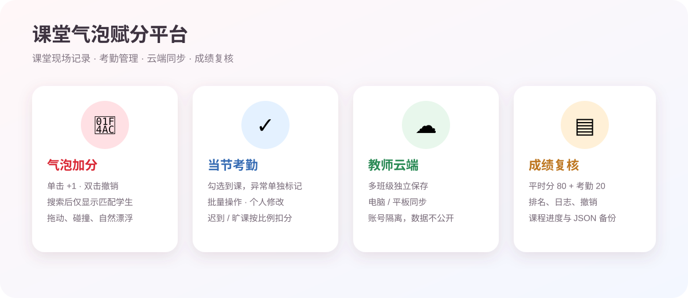

# 课堂气泡赋分平台

面向教师课堂现场的可视化平时成绩工具。学生以气泡呈现，教师点击一次即可记录一次课堂表现；气泡会漂浮、碰撞和回弹，让“记录表现”变成清晰、快速、可回溯的课堂操作。

## 立即体验

- [公开演示版](https://zcq19991029.github.io/classroom-bubble-score/)：使用虚构名单，无需登录。
- [教师云端版](https://zcq19991029.github.io/classroom-bubble-score/cloud.html)：登录后按账号保存多个班级，支持跨电脑、平板同步。

## 当前版本功能

### 课堂现场

- 课次按真实日期、单双周、星期和节次生成，支持 1-2、3-4 等连堂选择。
- 单击气泡记 1 次加分；双击撤销该生本节最近一次加分；长按打开个人考勤。
- 搜索姓名、完整学号或学号后两位时，只显示匹配学生，隐藏气泡不会接收点击，防止误加分。
- “本节 / 学期”磨砂切换，分别查看当前课次累计和整学期累计。
- 可拖动、抛出气泡；支持设备方向感应（平板需授予浏览器权限）。

### 成绩后台

- 学习表现按课堂有效参与次数累计，不按作业条数重复计算。
- 考勤单独占平时分 20 分，迟到、旷课按教师设置的扣分单位折算；正常到课无需逐人签到。
- 综合考核、课堂排名、按学号、按拼音、加减分和操作日志均可查看，并支持升序/降序。
- 排名按平时分计算；同分并列但占用实际名次位置，例如 1-5 名同分后下一位为第 6 名。
- 操作日志保留北京/本地时间、课次、学生、变动值、来源和变动后总分，便于核对操作时间。

### 考勤与管理

- 当节考勤只展示尚未确认的学生；勾选表示已到，其他人可选择迟到、旷课或自定义原因。
- 支持批量确认、批量清空某节记录、编辑个人记录和删除自定义规则。
- “加分”后台提供左减右加；手机未交、课堂捣乱等额外扣分有独立栏目和来源说明。
- 名单管理支持插班生、退学或参军学生的增删，历史记录仍保留。

### 课程进度与备份

- 课程进度以周为计划单位，以“班级＋实际课次”为填写单位，适应单双周和调课情况。
- 可关联教学进度表（图片、Word、PDF）作为预设参考，再手动填写实际进度。
- 支持 JSON 导出/导入备份；恢复前会校验学生、日志、考勤数组及分数汇总。

## 评分结构

平时成绩满分 100 分，由学习表现 80 分和考勤 20 分组成：

```text
平时成绩 = 学习表现（80） + 考勤（20）
综合成绩 = 平时成绩 × 40% + 期末笔试 × 60%
```

学习表现按有效参与次数排名赋分，第一名不强制从 100 分起算；考勤分按本学期计划课次和扣分单位比例化，具体参数可在后台调整。

## 三分钟上手

1. 打开教师云端版，登录并选择班级。
2. 在“选择课节”中选定本次日期、周次、星期和节次，点击开始上课。
3. 输入姓名或学号定位学生；单击记录一次表现，误触可双击撤销。
4. 点击“考勤”完成当节缺勤情况，再到“成绩后台”检查分数和日志。
5. 下课后导出备份；换设备登录同一账号即可读取云端班级数据。

## 本地版与云端版

| 能力 | 公开/本地版 | 教师云端版 |
| --- | --- | --- |
| 气泡、课次、加分、考勤 | 支持 | 支持 |
| 多班级 | 浏览器本地保存 | 账号云端保存 |
| 跨设备同步 | 需导出/导入备份 | 支持同一账号读取 |
| 学生数据 | 仅当前浏览器 | 仅当前教师账号（Supabase） |

GitHub Pages 只负责托管网页代码；教师的名单、积分和考勤保存在云端数据库或本机浏览器，不写入公开仓库。

## 本地启动

下载仓库后保持 `index.html`、`cloud.html`、`xlsx.full.min.js` 和图片资源的相对位置不变。Windows 用户可双击仓库内的“一键启动课堂加分系统.cmd”；也可直接打开 `index.html`。

## 界面预览




## 隐私与安全

- 公开仓库只放演示代码和虚构界面图，不要提交真实学生名单、成绩备份或登录凭据。
- 正式使用前请按学校考核方案设置计划课次、考勤扣分和及格线，并定期导出备份。
- 浏览器密码由浏览器凭据管理器保存；不要把密码写入 localStorage 或公开文件。

欢迎用于课堂教学、二次开发和教学管理研究。
